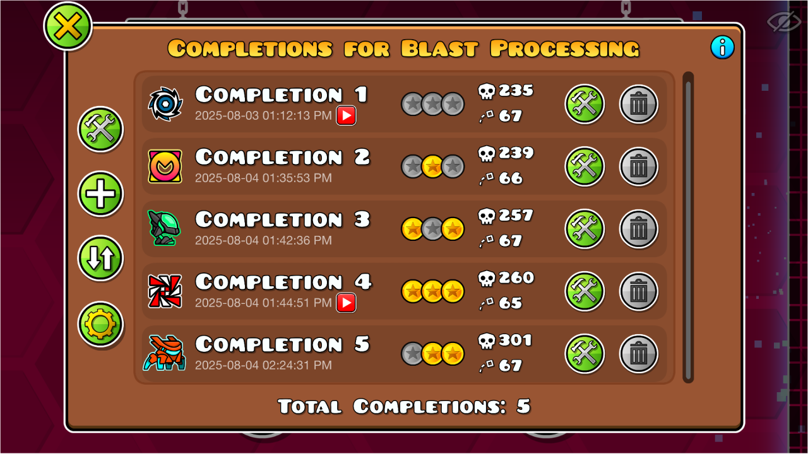
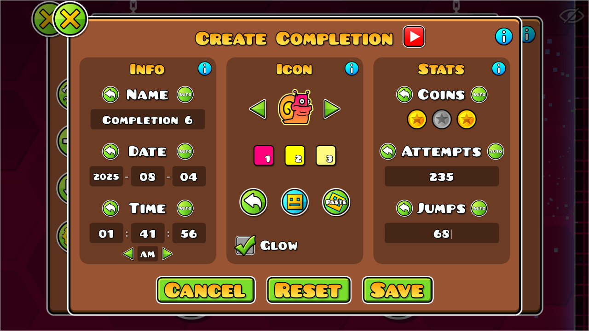
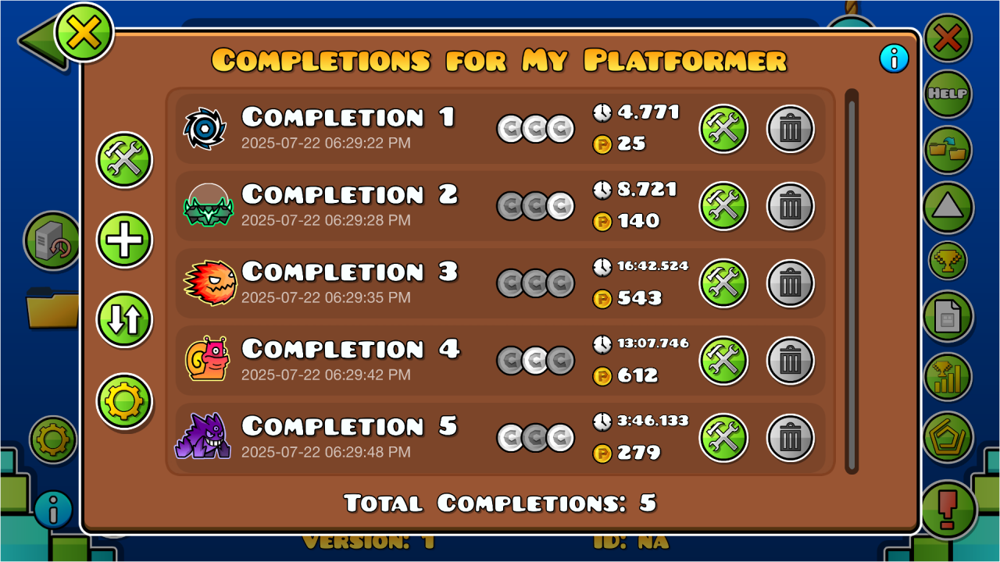

# Completion Tracker
by [Sawblade](https://gdbrowser.com/u/sawbladegd)

---
Tracks every time you complete an online or created level!
Completions can be edited using the completion editor.

The following stats are saved for each completion:
* Name, Date, Time, Coins, and Icon
* Jumps and Attempts on <cj>Classic</c> levels
* Level Time and Points on <cp>Platformer</c> levels
* YouTube video link

---
# Mod Options
* <cg>Time Format</c>: Use either 12-hour or 24-hour format when saving and displayng times
* <cj>Endscreen Button</c>: Adds a button to the endscreen to open the Completions list
* <cy>Autofill</c>: Automatically autofills data from the level upon opening the completion editor

Thanks to [Zilko](https://gdbrowser.com/u/zilko) for helping develop the mod!

---
## Previews

