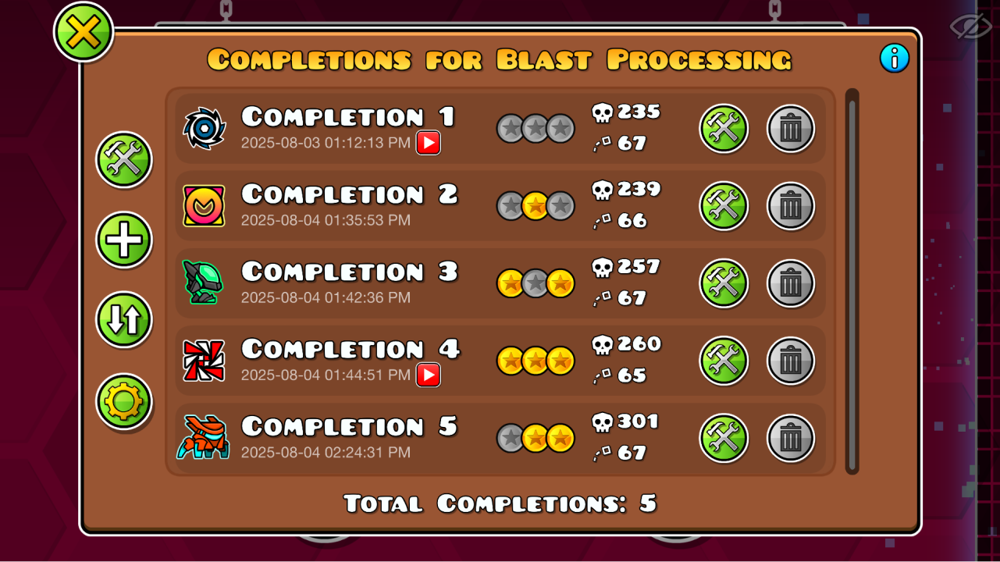

# Completion Tracker
by [Sawblade](https://gdbrowser.com/u/sawbladegd)

---
Tracks every time you complete an online or created level, with a completion editor!
The following stats are saved for each completion:
* Name, Date, Time, Coins, and Icon
* Jumps and Attempts on <cj>Classic</c> levels
* Level Time and Points on <cp>Platformer</c> levels

---
# Mod Options
* Time Format: Use either 12-hour or 24-hour format when saving and displayng times
* Endscreen Button: Adds a button to the endscreen to open the Completions list
* Autofill: Automatically autofills data from the level when creating a completion
* Blue Button: Changes the Completions button to a blue variant

Thanks to [Zilko](https://gdbrowser.com/u/zilko) for helping develop the mod!

---
## Previews

